# Optimistic Regressor

## Principle 

Notations:

Empirical distribution:

    q
    
Target:

    f = y_{max} - y
    
,e.g.,

    f = \frac{1}{1-\gamma} - \left(r + \gamma \max_{a'} Q(s', a')\right)

Optimistic loss:

    L(\theta) = \|f - f_{\theta}(x)\|_{2, q}^2 + \alpha \|f_{\theta}(x)\|_{2, 1 - q}^2
    
$L(\theta) = \|f - f_{\theta}(x)\|_{2, q}^2 + \alpha \|f_{\theta}(x)\|_{2, 1 - q}^2$

## Some results

|  | alpha = 0.1 | alpha = 0.5 | alpha = 1.0 | alpha = 1.5 | alpha = 2.0|
| ----------- | ----------- | ----------- | ----------- | ----------- | ----------- |
| ratio = 0.1 | 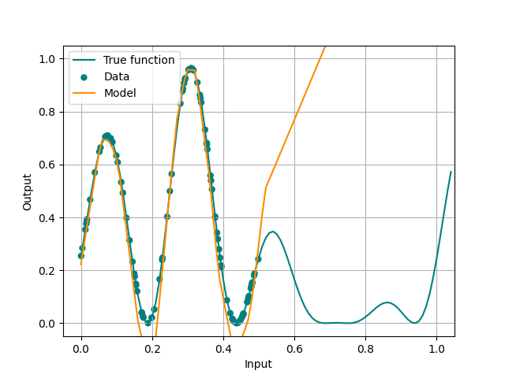 | 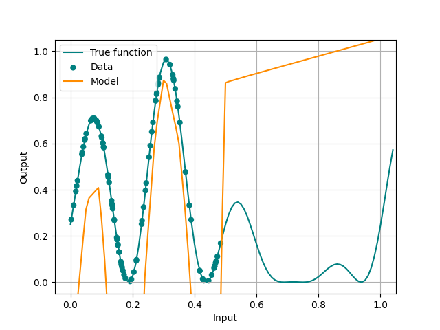|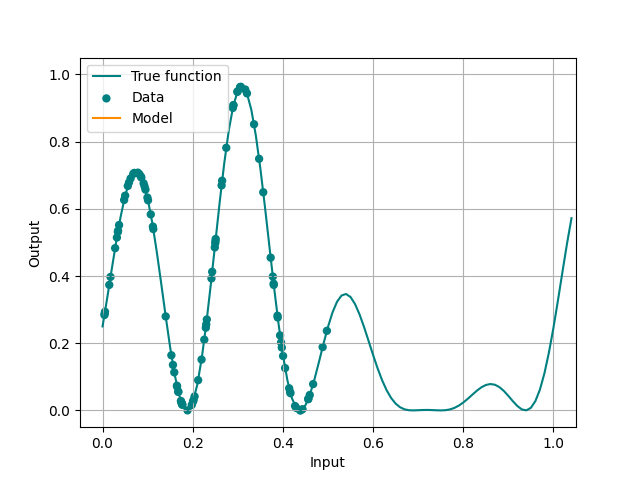 | 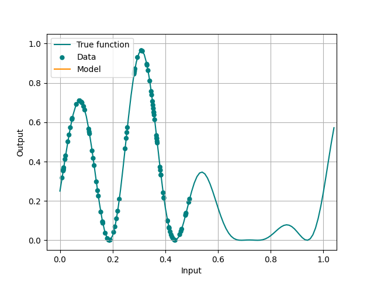| 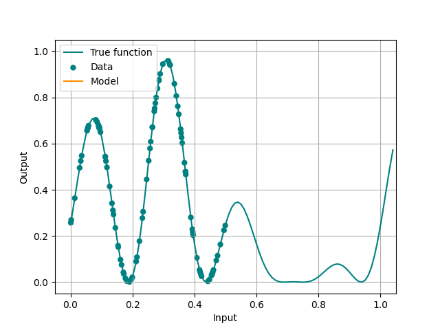|
| ratio = 0.5 | 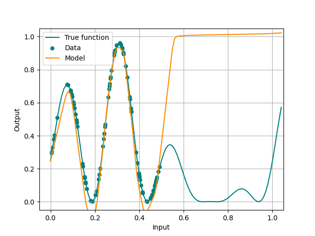 | 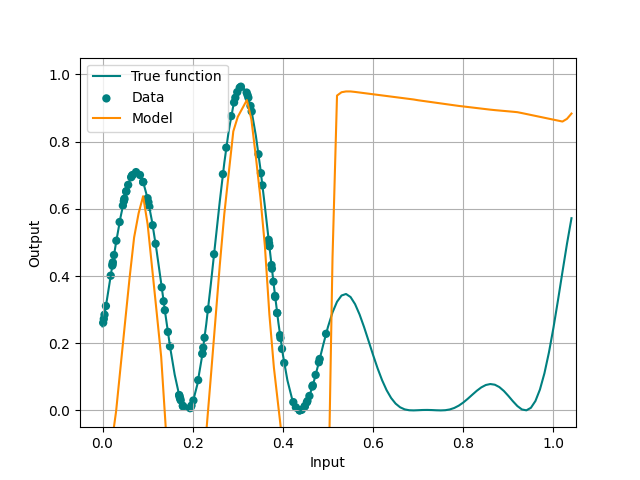|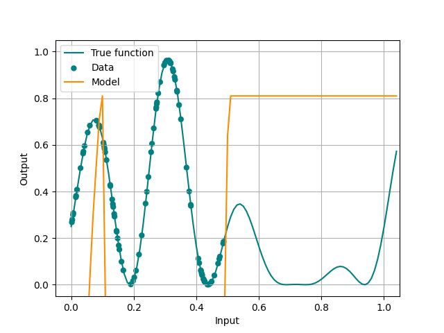 | 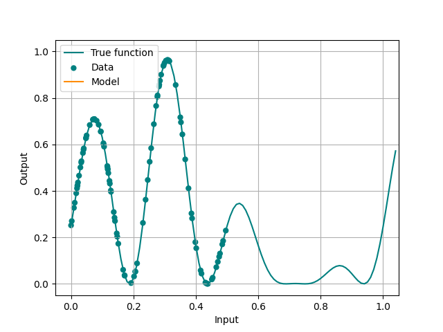| 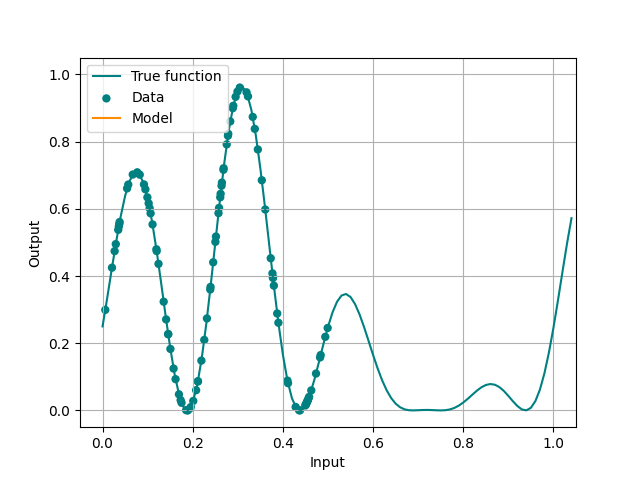|
| ratio = 1.0 | 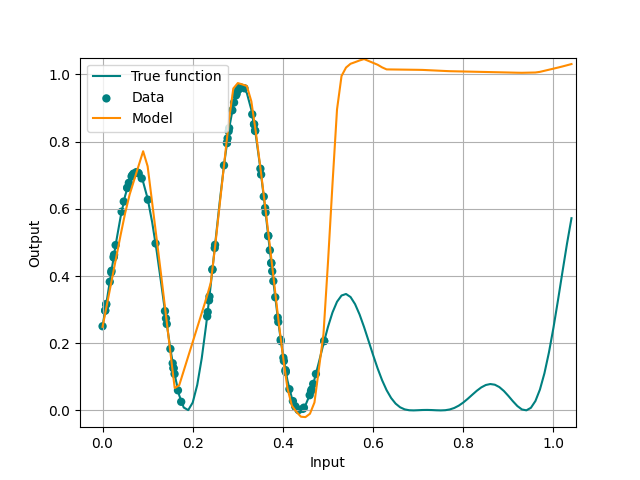 | 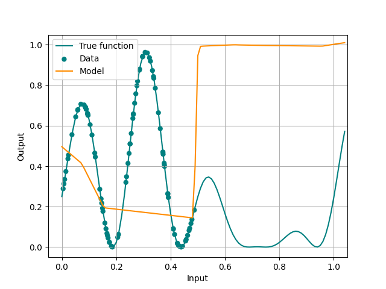|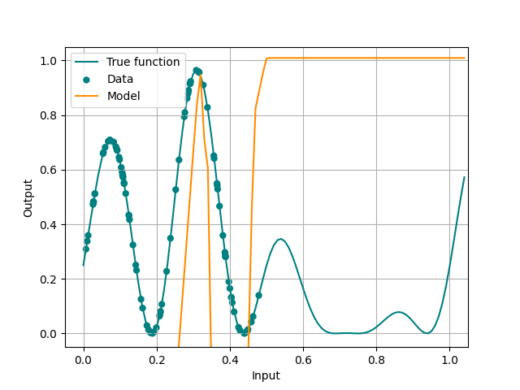 | 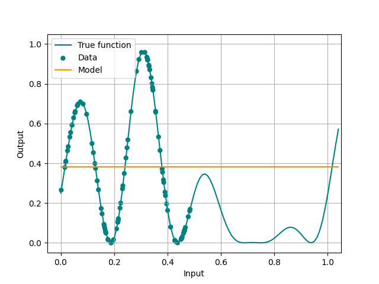| 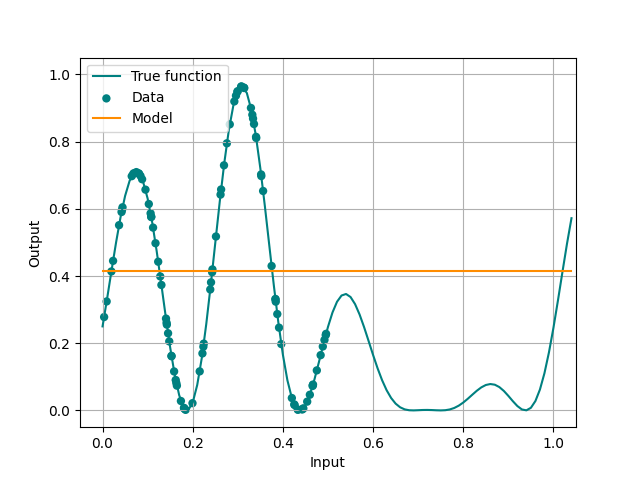|
| ratio = 1.5 | 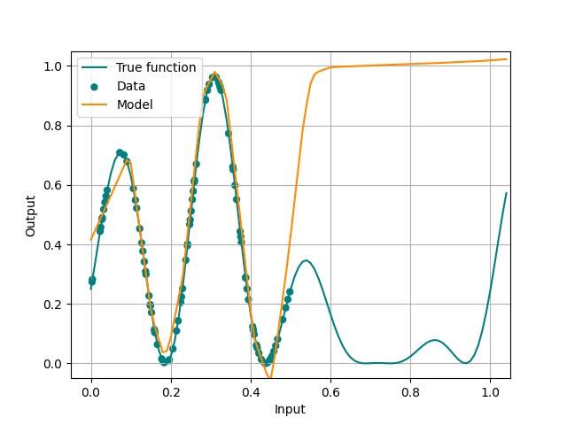 | 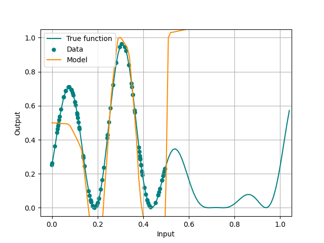|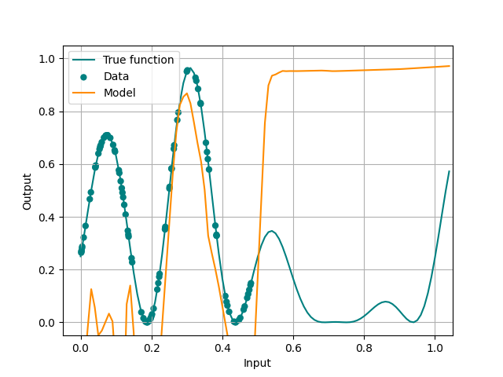 | 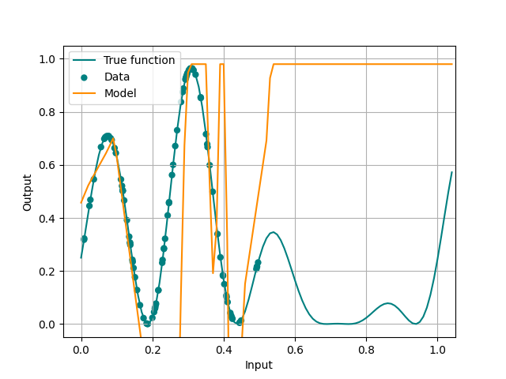| 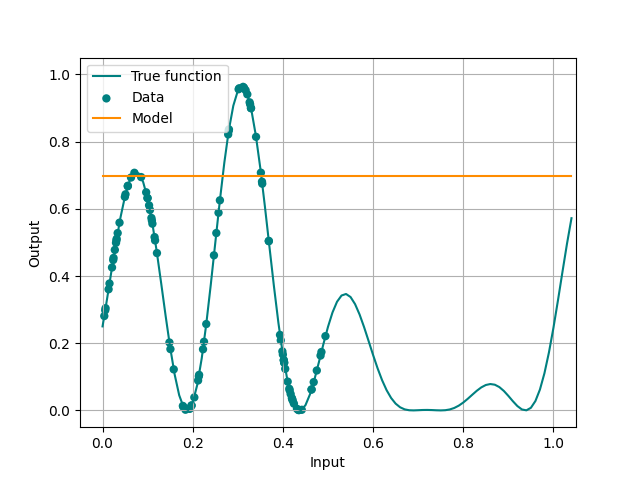|
| ratio = 2.0 | 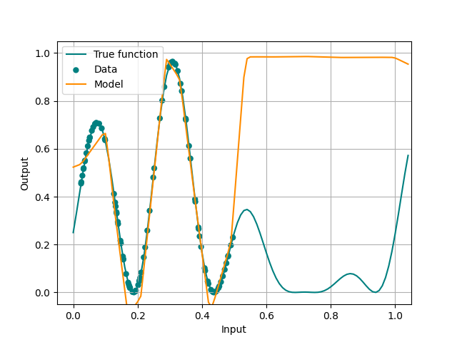 | 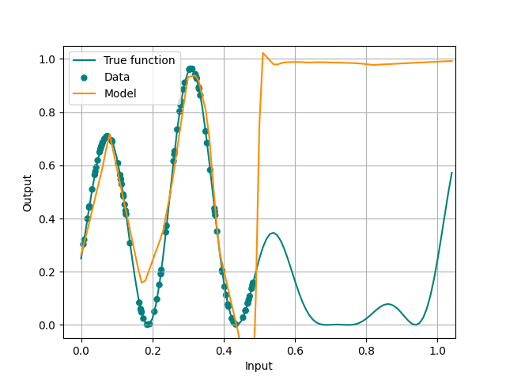|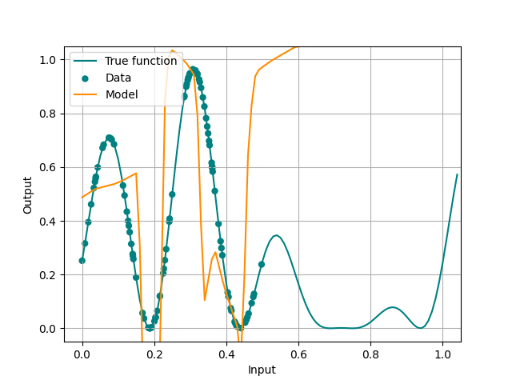 | 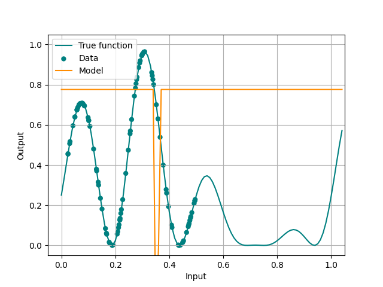| 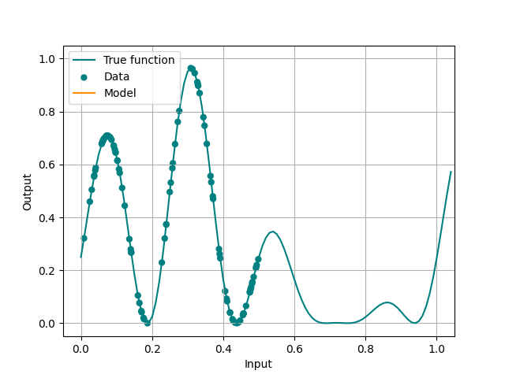|

## Using venv python library

For venv documentation: [click here](https://docs.python.org/3/library/venv.html)  
Activating:

	source ./venv/bin/activate
	
Deactivating:

	deactivate

## Dependencies

| Package | Version |
| ----------- | ----------- |
| Pillow | 8.0.1 |
| certifi | 2020.6.20 |
| configparser | 5.0.1 |
| cycler | 0.10.0 |
| dataclasses | 0.6 |
| future | 0.18.2 |
| kiwisolver | 1.3.1 |
| matplotlib | 3.3.2 |
| numpy | 1.19.4 |
| pip | 20.2.4 |
| pyparsing | 2.4.7 |
| python-dateutil | 2.8.1 |
| setuptools | 50.3.2 |
| six | 1.15.0 |
| torch | 1.7.0 |
| torchvision | 0.8.1 |
| typing-extensions | 3.7.4.3 |

